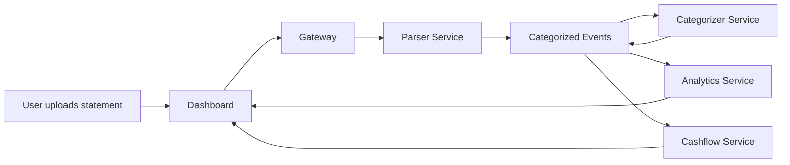

# data-flow

# Data Flow Architecture 🔄

End-to-end data flows in the M-PESA Analytics Platform.

---

## 1. Statement Upload Flow

2. Payment Flow (STK Push)
   mermaid

flowchart LR
User --> Dashboard
Dashboard --> Gateway
Gateway --> Payment[Payment Service]
Payment --> M-PESA[Safaricom Daraja]
M-PESA --> Payment[Callback]
Payment --> Kafka[Payment Event]
Kafka --> Analytics & Billing & Webhook

3. Dashboard Data Aggregation (BFF)
   flowchart LR
   Dashboard --> Gateway
   Gateway --> Analytics & Cashflow & Billing
   Analytics & Cashflow & Billing --> Gateway
   Gateway --> Dashboard

Key Data Flows Summary

Ingestion: User → Parser → Kafka → Categorizer → Analytics
Real-time: Payment callbacks → Kafka → Multiple consumers
Analytics: Aggregated views served via Gateway BFF layer
Notifications: Events → Webhook Service → External systems

Design Principles

Event-Driven: Loose coupling between services
Single Source of Truth: Kafka for important business events
Read Path Optimization: BFF pattern for dashboard performance
Resilience: Retries and circuit breakers on all critical paths

Last Updated: April 2026
