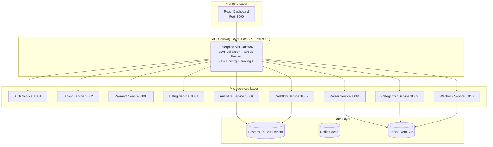

# overview

# Architecture Overview 🏗️

## System Architecture Diagram

```mermaid
flowchart TD

subgraph "Frontend Layer"
    Dashboard["React Dashboard<br>Port: 3000"]
end

subgraph "API Gateway Layer (FastAPI - Port 9000)"
    Gateway["Enterprise API Gateway<br>JWT Validation + Circuit Breaker<br>Rate Limiting + Tracing + BFF"]
end

subgraph "Microservices Layer"
    Auth["Auth Service :8001"]
    Tenant["Tenant Service :8002"]
    Payment["Payment Service :8007"]
    Billing["Billing Service :8008"]
    Parser["Parser Service :8004"]
    Categorizer["Categorizer Service :8009"]
    Analytics["Analytics Service :8000"]
    Cashflow["Cashflow Service :8005"]
    Webhook["Webhook Service :8010"]
end

subgraph "Data Layer"
    Postgres[(PostgreSQL Multi-tenant)]
    Redis[(Redis Cache)]
    Kafka[(Kafka Event Bus)]
end

Dashboard --> Gateway

Gateway --> Auth
Gateway --> Tenant
Gateway --> Payment
Gateway --> Billing
Gateway --> Parser
Gateway --> Categorizer
Gateway --> Analytics
Gateway --> Cashflow
Gateway --> Webhook

Parser --> Kafka
Categorizer --> Kafka
Analytics --> Postgres
Cashflow --> Postgres
Webhook --> Kafka
```
