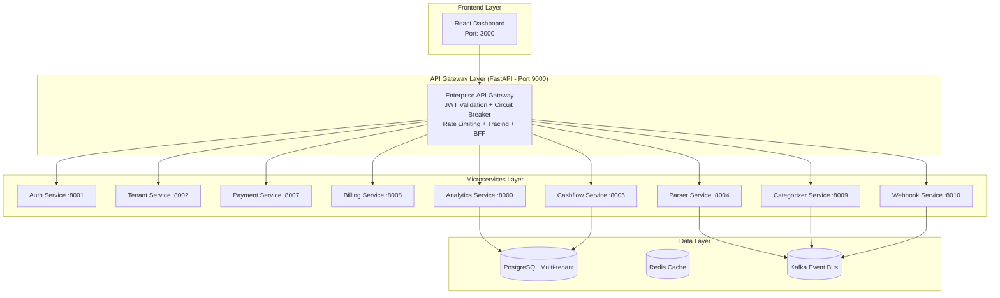

## System Architecture Diagram

Core Design Principles
Principle	Implementation
Multi-Tenancy First	Strong data isolation (Schema-per-tenant for Pro, Database-per-tenant for Enterprise)
Event-Driven Architecture	Kafka as the backbone for async communication
Zero-Trust Security	JWT validation at the API Gateway edge
Resilience by Design	Circuit breakers, retries, and graceful degradation
Observability	Correlation IDs, structured logging, Prometheus metrics
Scalability	Stateless services + horizontal scaling ready
Data Flow Example (Statement Upload)
text
1. User uploads M-PESA statement via Dashboard
2. Gateway forwards to Parser Service
3. Parser extracts transactions → publishes to Kafka (raw-transactions)
4. Categorizer Service consumes, applies rules/ML → publishes categorized events
5. Analytics Service and Cashflow Service consume and aggregate insights
6. Dashboard pulls summarized data via Gateway (BFF pattern)
Technology Choices
Layer	Technology	Reason
API Gateway	FastAPI	Performance + async
Backend Services	FastAPI + Python 3.12	Rapid development
Database	PostgreSQL	Reliability + multi-tenancy
Cache	Redis	Speed
Messaging	Kafka	Event-driven decoupling
Frontend	React + TypeScript	Rich UI
Deployment	Docker + Kubernetes-ready	Portability
Scalability Strategy
Horizontal scaling of stateless services

Read replicas for analytics

Separate read/write paths where needed

Caching at multiple layers

Last Updated: April 16, 2026
Version: 1.0
