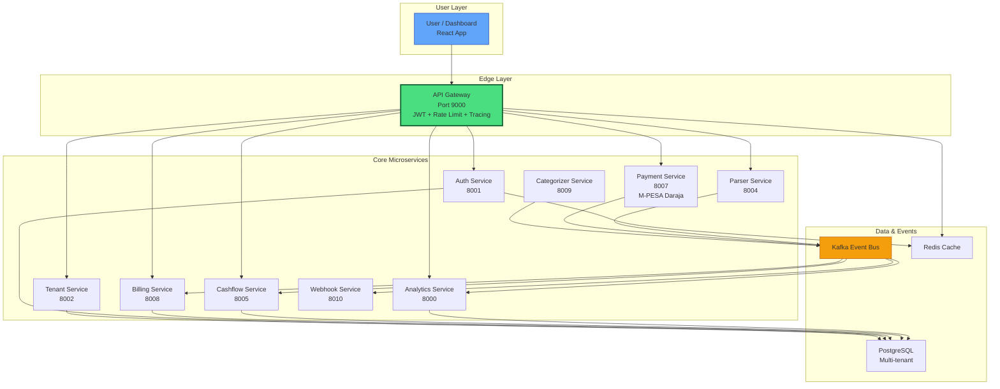

# Detailed Service Interaction Diagram 🔄

```mermaid
flowchart TB
    subgraph "User Layer"
        User[User / Dashboard\nReact App]
    end

    subgraph "Edge Layer"
        Gateway[API Gateway\nPort 9000\nJWT + Rate Limit + Tracing]
    end

    subgraph "Core Microservices"
        Auth[Auth Service\n8001]
        Tenant[Tenant Service\n8002]
        Payment[Payment Service\n8007\nM-PESA Daraja]
        Parser[Parser Service\n8004]
        Categorizer[Categorizer Service\n8009]
        Analytics[Analytics Service\n8000]
        Cashflow[Cashflow Service\n8005]
        Billing[Billing Service\n8008]
        Webhook[Webhook Service\n8010]
    end

    subgraph "Data & Events"
        Kafka[Kafka Event Bus]
        Postgres[PostgreSQL\nMulti-tenant]
        Redis[Redis Cache]
    end

    %% Main Flows
    User --> Gateway
    Gateway --> Auth
    Gateway --> Tenant
    Gateway --> Payment
    Gateway --> Parser
    Gateway --> Analytics
    Gateway --> Cashflow
    Gateway --> Billing

    %% Async Flows
    Parser --> Kafka
    Payment --> Kafka
    Categorizer --> Kafka
    Kafka --> Analytics
    Kafka --> Cashflow
    Kafka --> Billing
    Kafka --> Webhook

    %% Database Access
    Analytics --> Postgres
    Cashflow --> Postgres
    Billing --> Postgres
    Tenant --> Postgres
    Auth --> Postgres

    %% Caching
    Gateway --> Redis
    Auth --> Redis

    style Gateway fill:#4ade80,stroke:#166534,stroke-width:3px
    style User fill:#60a5fa,stroke:#1e40af
    style Kafka fill:#f59e0b,stroke:#b45309
```

Legend

Solid arrows = Synchronous HTTP requests (via Gateway)
Dashed arrows = Asynchronous events (via Kafka)
Green box = Critical infrastructure layer
