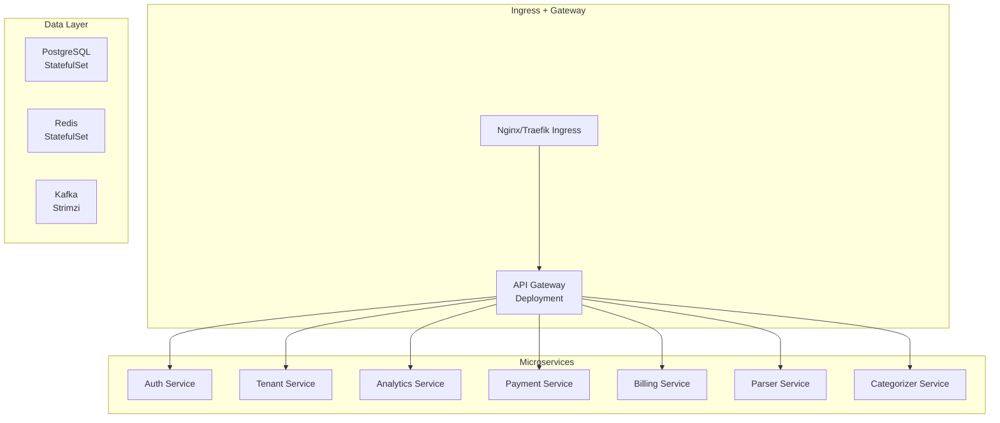

# kubernetes

# Kubernetes Deployment Guide ☸️

How to deploy the M-PESA Analytics Platform on Kubernetes.

---

## Prerequisites

- Kubernetes cluster (v1.25+)
- kubectl configured
- Helm v3 (optional but recommended)
- PostgreSQL operator or managed database
- Redis operator or managed Redis
- Kafka (Strimzi or managed)

---

## Recommended Architecture

Deployment Methods
Option 1

helm repo add black-opps https://charts.black-opps.dev
helm install mpesa-platform black-opps/mpesa-platform --namespace mpesa --create-namespace

Option 2

kubectl apply -f k8s/namespace.yaml
kubectl apply -f k8s/postgres/
kubectl apply -f k8s/services/
kubectl apply -f k8s/gateway/
