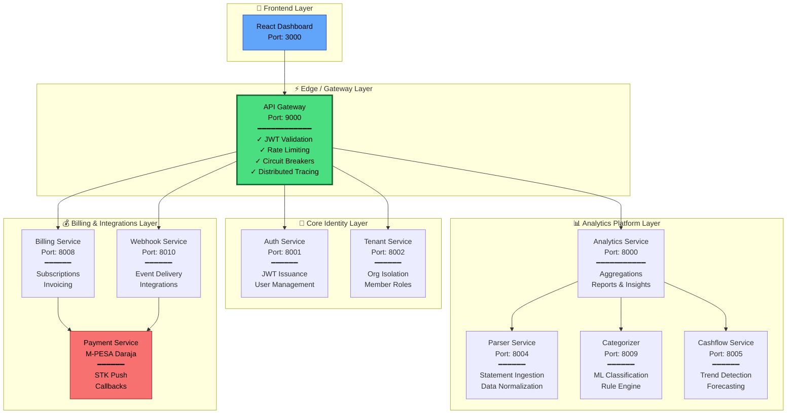

# M-PESA Analytics Platform

## Enterprise SaaS for Financial Intelligence

- :material-microservices: **11 Production Microservices**

  ***

  Distributed architecture with API Gateway, auth, tenant isolation, analytics pipeline, and event-driven messaging. Built for scale.

- :material-gateway: **Enterprise API Gateway**

  ***

  JWT edge validation · Rate limiting · Circuit breakers · Distributed tracing · BFF pattern · Prometheus metrics

- :material-cloud-check: **Multi-Cloud Certified**

  ***

  4x Oracle Certified · 5x AWS Badges · Docker · Kubernetes-ready · Production-grade

---

## System Architecture

